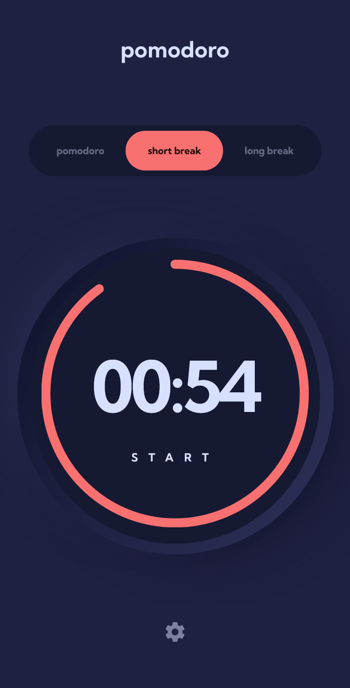

# Frontend Mentor - Pomodoro app solution

This is a solution to the [Pomodoro app challenge on Frontend Mentor](https://www.frontendmentor.io/challenges/pomodoro-app-KBFnycJ6G). Frontend Mentor challenges help you improve your coding skills by building realistic projects.

## Table of contents

- [Overview](#overview)
  - [The challenge](#the-challenge)
  - [Screenshot](#screenshot)
  - [Links](#links)
- [My process](#my-process)
  - [Built with](#built-with)
  - [What I learned](#what-i-learned)
  - [Continued development](#continued-development)
- [Author](#author)

## Overview

### The challenge

Users should be able to:

- Set a pomodoro timer and short & long break timers
- Customize how long each timer runs for
- See a circular progress bar that updates every minute and represents how far through their timer they are
- Customize the appearance of the app with the ability to set preferences for colors and fonts

### Screenshot

### Links

- Solution URL: [Add solution URL here](https://your-solution-url.com)
- Live Site URL: [App](https://webguy83.github.io/pomodoro-react/)

## My process

### Built with

- React and Material UI
- TypeScript
- [React](https://reactjs.org/) - JS library
- [MUI](https://mui.com/) - Material UI
- [TypeScript](https://www.typescriptlang.org/) - TypeScript docs

### What I learned

Learned a bunch of new tricks mostly with MUI components I never used before such as the Circle progress and custom theming.

### Continued development

Look at tackleing the most advanced types of projects out there.

## Author

- Frontend Mentor - [@webguy83](https://www.frontendmentor.io/profile/webguy83)
